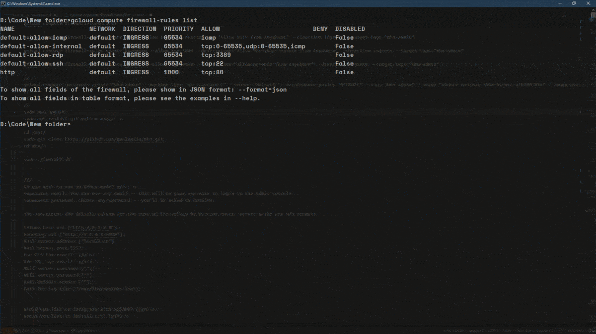
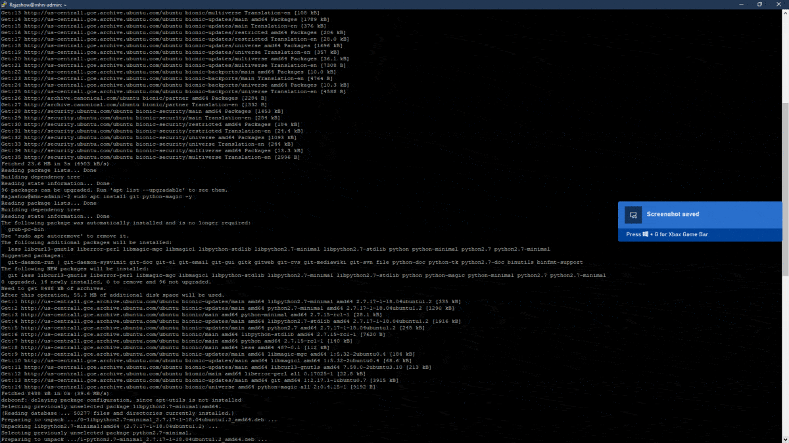
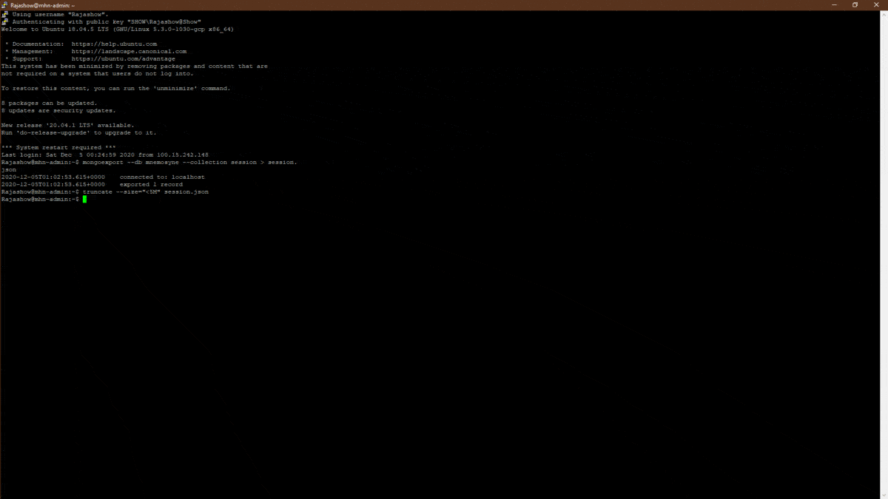

# Honeypot Assignment

**Time spent:** **15** hours spent in total

**Objective:** Create a honeynet using MHN-Admin. Present your findings as if you were requested to give a brief report of the current state of Internet security. Assume that your audience is a current employer who is questioning why the company should allocate anymore resources to the IT security team.

## MHN-Admin Deployment (Required)

**Summary:** How did you deploy it? Did you use GCP, AWS, Azure, Vagrant, VirtualBox, etc.?
I used GCP and compute engine to create honeypot network and attack it using kail.I used the following commands to init my instance.

### Create the Modern Honey Network

```bash
gcloud compute firewall-rules list

gcloud compute firewall-rules create http --allow tcp:80 --description="Allow HTTP from Anywhere" --direction ingress --target-tags="mhn-admin"

gcloud compute firewall-rules create honeymap --allow tcp:3000 --description="Allow HoneyMap Feature from Anywhere" --direction ingress --target-tags="mhn-admin"

gcloud compute firewall-rules create hpfeeds --allow tcp:10000 --description="Allow HPFeeds from Anywhere" --direction ingress --target-tags="mhn-admin"

gcloud compute instances create "mhn-admin" --machine-type "n1-standard-1" --subnet "default" --maintenance-policy "MIGRATE" --tags "mhn-admin" --image "ubuntu-minimal-1804-bionic-v20200703a" --image-project "ubuntu-os-cloud" --boot-disk-size "10" --boot-disk-type "pd-standard" --boot-disk-device-name "mhn-admin"
```

### Setup the MHN

```bash
gcloud compute ssh mhn-admin
sudo apt update
sudo apt install git python-magic -y

cd /opt/
sudo git clone https://github.com/pwnlandia/mhn.git
cd mhn/

sudo ./install.sh
```

#### Config for MHN

```txt
Do you wish to run in Debug mode? y/n : n
Superuser email: You can use any email -- this will be your username to login to the admin console.
Superuser password: Choose any password -- you'll be asked to confirm.

You can accept the default values for the rest of the values by hitting enter. Answer n for any y/n prompts:

Server base url ["http://#.#.#.#"]:
Honeymap url ["http://#.#.#.#:3000"]:
Mail server address ["localhost"]:
Mail server port [25]:
Use TLS for email?: y/n n
Use SSL for email?: y/n n
Mail server username [""]:
Mail server password [""]:
Mail default sender [""]:
Path for log file ["/var/log/mhn/mhn.log"]:


Would you like to integrate with Splunk? (y/n) n
Would you like to install ELK? (y/n) n

Last question ...

Would you like to add MHN rules to UFW? (y/n) n
```



<!-- step 3 -->

## Dionaea Honeypot Deployment (Required)

**Summary:** Briefly in your own words, what does dionaea do?

dionaea is honey pot vm that honeypot that captures attack payloads and malware

### Creating the honeypot

```bash
gcloud compute firewall-rules create wideopen --description="Allow TCP and UDP from Anywhere" --direction ingress --priority=1000 --network=default --action=allow --rules=tcp,udp --source-ranges=0.0.0.0/0 --target-tags="honeypot"
gcloud compute instances create "honeypot-1" --machine-type "n1-standard-1" --subnet "default" --maintenance-policy "MIGRATE" --tags "honeypot" --image "ubuntu-minimal-1804-bionic-v20200703a" --image-project "ubuntu-os-cloud" --boot-disk-size "10" --boot-disk-type "pd-standard" --boot-disk-device-name "honeypot-1"
```



## Database Backup (Required)

<!-- exported -->

**Summary:** What is the RDBMS that MHN-Admin uses? What information does the exported JSON file record?

The MHN uses Mongodb. the json file has information on the attack such as the time of attack, src & dest ip and port, protocol and other info.

``` bash
nmap -A -T4 35.225.x.x
```

```bash
mongoexport --db mnemosyne --collection session > session.json
truncate --size="<5M" session.json
gcloud compute scp mhn-admin:~/session.json ./session.json
```


*Be sure to upload session.json directly to this GitHub repo/branch in order to get full credit.*

## Notes

Describe any challenges encountered while doing the assignment.

`no challenges`.
